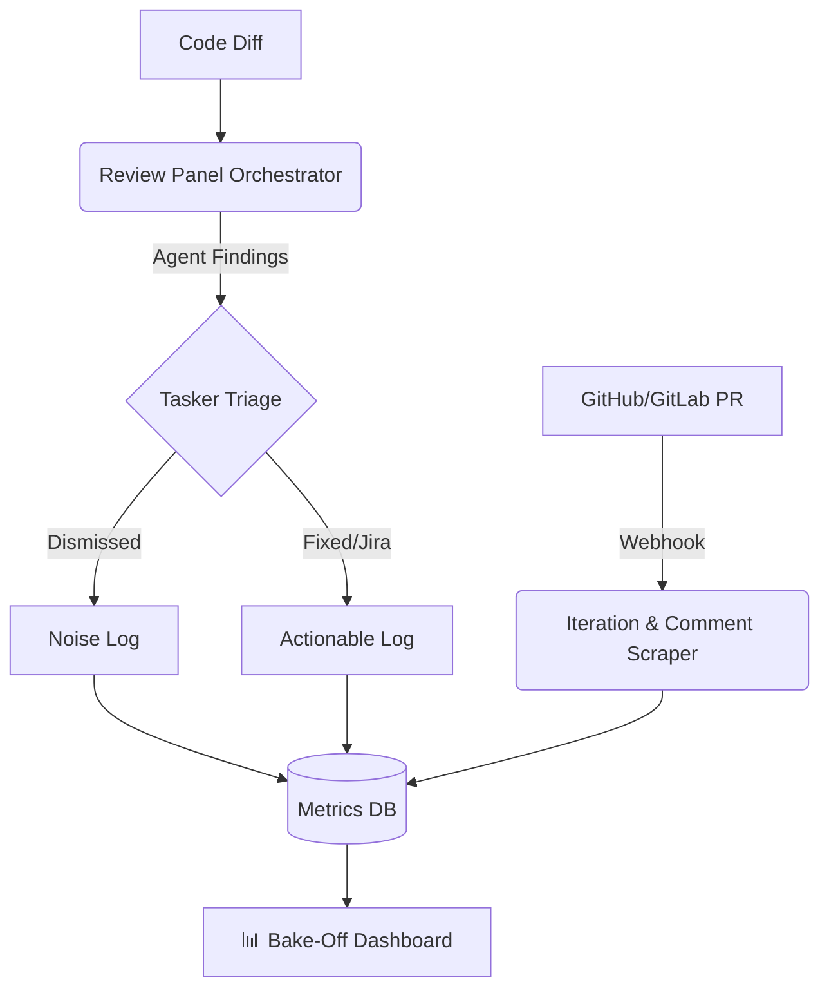

# Multi-Agent Bake-Off: Evaluation Dashboard Design

## 🎯 Objective
To establish a purely data-driven framework for evaluating **Claude, Grok, Codex, and AGY**. This dashboard will move beyond subjective "vibes" and quantitatively measure how each agent performs across two distinct roles: **Coder** (writing the code) and **Reviewer** (auditing the code).

---

## 📊 Core Metrics to Track

### 1. Reviewer Quality (Signal-to-Noise)
AI reviewers are prone to pedantic nitpicks. This metric tracks whether an agent's feedback is actually useful.
* **True Positives (Actionable):** Finding resulted in a code change or a deferred Jira ticket.
* **False Positives (Noise):** Finding was dismissed by the Tasker (or human) as junk, out-of-scope, or incorrect.
* **Metric - Precision:** `Actionable / Total Findings` *(We want high precision to avoid alert fatigue).*

### 2. Reviewer Blind Spots (False Negatives)
Did the AI miss something obvious that a human had to catch?
* **Human/Bot Catches:** An issue raised in a GitHub/GitLab PR comment by a human or traditional linter that the AI panel missed entirely.
* **Metric - Miss Rate:** `Human Catches / Total PR Findings`

### 3. Coder Iteration Velocity
Evaluates how well the agent *writes* code on its first try.
* **AI Go-backs:** The number of times the Reviewer Panel forced an `ITERATE` loop.
* **Human Go-backs:** The number of human PR comments requesting changes.
* **Metric - Cycles to Merge:** Average number of review iterations required before a PR is successfully merged.

---

## 🔌 Data Sources & Pipeline

To build this without manual overhead, we can stitch together 3 data sources:

1. **The Orchestrator (`main.go`)**: Logs the raw findings, tagging each with its `agent_source`.
2. **The Tasker (Triage Output)**: Emits a structured JSON log of its triage decisions (e.g., `FIXED`, `JIRA`, `DISMISSED_NOISE`).
3. **VCS Webhooks (GitHub/GitLab)**: Listens for PR merges. Scrapes the total number of human comments and commits to calculate the "Go-back" iteration count.

---

## 📈 Proposed Dashboard Views

### View 1: The Reviewer Matrix
A scatter plot or table comparing Actionability vs. Volume.
| Agent | Total Findings | Actionable (SNR) | Critical Misses | Verdict |
| :--- | :--- | :--- | :--- | :--- |
| **Claude** | 45 | 88% | 0 | *High trust, low noise* |
| **Codex** | 120 | 31% | 2 | *Too noisy, alert fatigue* |
| **Grok** | 25 | 92% | 1 | *Quiet but accurate* |
| **AGY** | 50 | 75% | 0 | *Balanced* |

### View 2: Coder Efficiency (Time-to-Merge)
How much "babysitting" did the agent need when writing the code?
* **Codex-Authored PRs:** Avg. 4.2 iterations, 12 human comments.
* **Claude-Authored PRs:** Avg. 1.5 iterations, 2 human comments.

### View 3: The Blind Spot Log
A running feed of PR comments made by humans that the AI missed.
> **PR #1274 - Human Reviewer:** *"This breaks the caching layer entirely."*
> **AI Panel:** `0 Findings related to caching.`
> **Action:** Adjust the System Prompt for the AI reviewers to check for caching side-effects.
